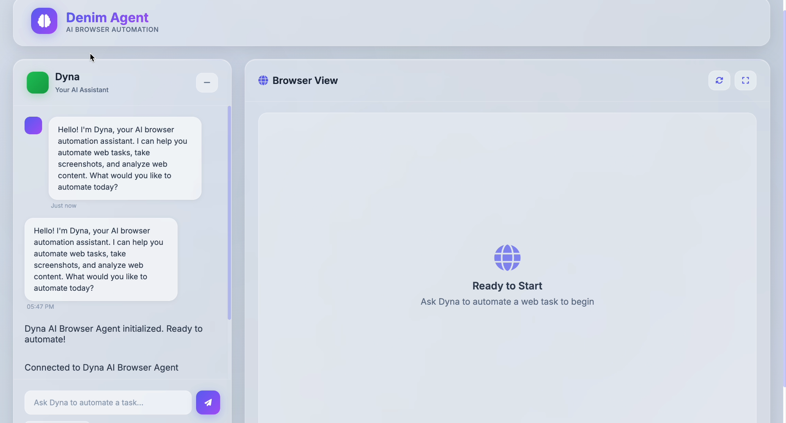
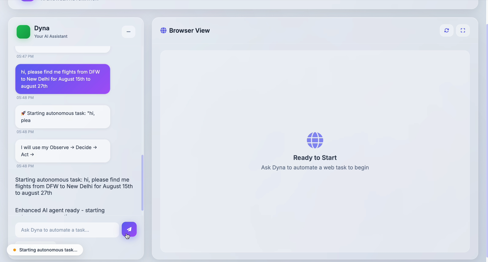
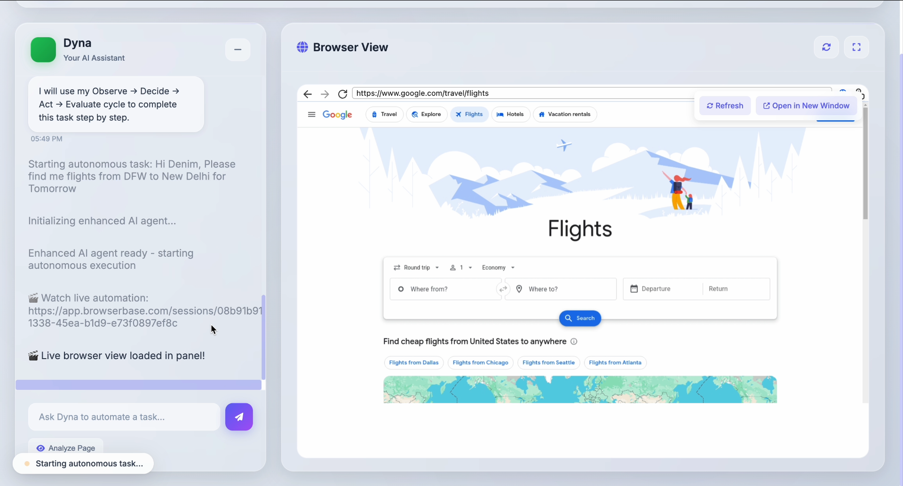
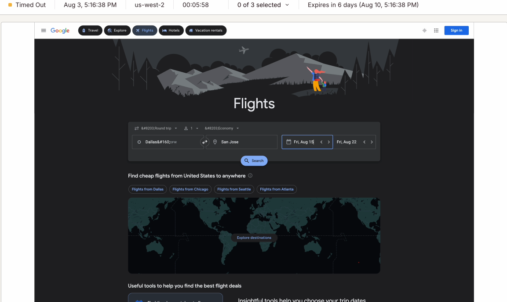

# Dyna AI Browser Agent 🤖

A comprehensive browser automation agent that combines **Browserbase Node.js SDK**, **Playwright**, and **Gemini AI** for intelligent web automation with a beautiful glass morphism UI.











## ✨ Features

### 🎨 Modern Glass Morphism UI
- **Dyna AI Chatbox**: Copilot-style conversational interface
- **Minimalist Design**: Light pastel colors with glass effects
- **Real-time Activity**: Integrated activity messages in chat
- **Responsive Layout**: 2-column layout with chat and browser view

### 🤖 Intelligent Browser Automation
- **BrowserAgent Class**: Comprehensive automation engine built with Node.js
- **Browserbase Integration**: Cloud-based browser sessions using official `@browserbasehq/sdk`
- **Playwright Control**: Full browser automation capabilities with `playwright-core`
- **Gemini AI Analysis**: Intelligent page analysis and decision making

### 🔧 Advanced Capabilities
- **Smart Navigation**: URL navigation with task completion
- **Page Analysis**: AI-powered content understanding
- **Action Execution**: Click, type, scroll, wait operations
- **Screenshot Capture**: High-quality page screenshots
- **Session Management**: Automatic session handling and cleanup

## 🚀 Quick Start

### Prerequisites
- **Node.js 18+** (JavaScript/TypeScript runtime)
- **Browserbase API account** (for cloud browser sessions)
- **Google Gemini API key** (for AI analysis)

> **Note:** This project uses the **Node.js SDK** for all integrations. All examples and documentation are for JavaScript/Node.js implementation.

### Installation

1. **Clone the repository**
```bash
git clone <repository-url>
cd Denim_Agent
```

2. **Install dependencies**
```bash
npm install
```

**Key Node.js SDK Dependencies:**
- `@browserbasehq/sdk` - Official Browserbase Node.js SDK
- `playwright-core` - Playwright browser automation  
- `@google/generative-ai` - Google Gemini AI SDK
- `express` - Web server framework
- `socket.io` - Real-time communication

3. **Configure environment**
```bash
cp .env.example .env
# Edit .env with your API keys
```

4. **Start the server**
```bash
npm start
# or for development
npm run dev
```

5. **Open in browser**
```
http://localhost:3000
```

## ⚙️ Configuration

### Required Environment Variables
```bash
# Gemini AI Configuration
GEMINI_API_KEY=your_gemini_api_key_here

# Browserbase Configuration  
BROWSERBASE_API_KEY=your_browserbase_api_key_here
BROWSERBASE_PROJECT_ID=your_browserbase_project_id_here
```

### Optional Settings
```bash
# Browser Agent Configuration
SESSION_TIMEOUT=300000          # 5 minutes
MAX_RETRIES=3                   # Action retry limit
SCREENSHOT_QUALITY=80           # Screenshot quality
ENABLE_LOGGING=true             # Debug logging

# Server Configuration
PORT=3000                       # Server port
NODE_ENV=development            # Environment
```

## 🎯 Usage

### Via Dyna Chat Interface

1. **Start a Conversation**
   - Type your automation task in the chat
   - Dyna will understand and execute complex requests

2. **Example Commands**
   - "Take a screenshot of google.com"
   - "Navigate to wikipedia.org and search for artificial intelligence"
   - "Find all forms on this page and analyze them"
   - "Click the login button and fill the form"

3. **Quick Actions**
   - Use the quick action buttons for common tasks
   - Take Screenshot, Analyze Page, Find Forms, List Links

### Programmatic Usage

```javascript
const BrowserAgent = require('./lib/BrowserAgent');

// Initialize the agent
const agent = new BrowserAgent({
    browserbaseApiKey: 'your_key',
    browserbaseProjectId: 'your_project',
    geminiApiKey: 'your_gemini_key'
});

// Initialize browser session
await agent.initialize();

// Navigate and complete task
const result = await agent.navigateAndProcess(
    'https://example.com',
    'Find the contact form and analyze its fields'
);

// Analyze current page
const analysis = await agent.analyzePageWithGemini(
    'What products are featured on this page?'
);

// Execute specific actions
await agent.executeAction('click', { target: 'button[type="submit"]' });
await agent.executeAction('type', { target: 'input[name="email"]', value: 'test@example.com' });

// Clean up
await agent.cleanup();
```

## 🏗️ Architecture

### Core Components

1. **BrowserAgent Class** (`lib/BrowserAgent.js`)
   - Manages Browserbase sessions
   - Controls Playwright browser automation
   - Integrates with Gemini AI for intelligent decisions
   - Handles action execution and error recovery

2. **Server** (`server.js`)
   - Express.js web server
   - Socket.io for real-time communication
   - REST API endpoints for file uploads
   - BrowserAgent integration

3. **Client** (`public/`)
   - Modern glass morphism UI
   - Dyna AI chatbox interface
   - Real-time browser view
   - Activity logging system

### Key Features

#### Intelligent Page Analysis
- **Screenshot Analysis**: Visual understanding with Gemini Vision
- **DOM Extraction**: Text content, forms, links, buttons
- **Action Planning**: AI-generated automation steps
- **Context Awareness**: Maintains conversation context

#### Robust Action Execution
- **Smart Element Finding**: Multiple selector strategies
- **Error Recovery**: Automatic retries with exponential backoff
- **Action Validation**: Confirm actions were successful
- **Screenshot Verification**: Visual confirmation of changes

#### Session Management
- **Cloud Sessions**: Browserbase for reliable browser automation
- **Timeout Handling**: 5-minute session keepAlive
- **Auto-cleanup**: Proper resource management
- **Replay URLs**: Session recording for debugging

## 🔍 API Reference

### BrowserAgent Methods

#### `initialize()`
Initialize browser session and AI models
```javascript
const result = await agent.initialize();
// Returns: { success: true, sessionId: string, replayUrl: string }
```

#### `navigateAndProcess(url, task, options)`
Navigate to URL and complete specified task
```javascript
const result = await agent.navigateAndProcess(
    'https://example.com',
    'Find and analyze the contact form',
    { includeScreenshot: true, executeActions: true }
);
```

#### `analyzePageWithGemini(instruction, options)`
Analyze current page with AI
```javascript
const analysis = await agent.analyzePageWithGemini(
    'What are the main navigation options?',
    { includeScreenshot: true, includeDom: true }
);
```

#### `executeAction(actionType, parameters)`
Execute specific browser action
```javascript
await agent.executeAction('click', { target: 'button.submit' });
await agent.executeAction('type', { target: 'input[name="search"]', value: 'query' });
```

### Socket Events

#### Client → Server
- `startAutomation` - Begin automation task
- `executeAction` - Execute specific action  
- `analyzePage` - Analyze current page
- `takeScreenshot` - Capture screenshot

#### Server → Client
- `automationResult` - Task completion results
- `analysisResult` - Page analysis results
- `activityUpdate` - Real-time status updates
- `screenshot` - Page screenshots
- `sessionInfo` - Browser session details

## 🛠️ Development

### Project Structure
```
Denim_Agent/
├── lib/
│   └── BrowserAgent.js     # Core automation engine
├── public/
│   ├── index.html          # Main UI
│   ├── script.js           # Client JavaScript
│   └── styles.css          # Glass morphism styles
├── uploads/                # File upload directory
├── server.js               # Express server
├── package.json            # Dependencies
└── .env.example            # Configuration template
```

### Adding New Features

1. **New Actions**: Add to `BrowserAgent.executeAction()`
2. **UI Components**: Update `public/index.html` and `styles.css`
3. **Socket Events**: Add handlers in both client and server
4. **AI Prompts**: Enhance `buildAnalysisPrompt()` method

### Testing

1. **Manual Testing**: Use the Dyna chat interface
2. **Browserbase Replay**: View session recordings
3. **Console Logging**: Enable debug logging in `.env`
4. **Screenshot Verification**: Visual confirmation of actions

## 🎨 UI Customization

### Glass Morphism Theme
The UI uses a modern glass morphism design with:
- **Backdrop blur effects** for depth
- **Light pastel colors** (blues, purples, greens)
- **Subtle gradients** and shadows
- **Inter font family** for clean typography

### Customizing Colors
Edit `public/styles.css` variables:
```css
:root {
    --primary-color: #667eea;
    --secondary-color: #764ba2;
    --accent-color: #f093fb;
    --success-color: #4ecdc4;
    --warning-color: #ffe066;
    --error-color: #ff6b6b;
}
```

## 🔧 Troubleshooting

### Common Issues

1. **"Browserbase is not a constructor"**
   - Use destructured import: `const { Browserbase } = require('@browserbasehq/sdk');`
   - Check that you have the latest SDK version: `npm install @browserbasehq/sdk@latest`
   - Verify API key and project ID are set correctly

2. **"BrowserAgent is not initialized"**
   - This happens when the initial setup fails
   - Check that all required environment variables are set:
     - `BROWSERBASE_API_KEY`
     - `BROWSERBASE_PROJECT_ID` 
     - `GEMINI_API_KEY`
   - The agent will show detailed setup instructions in the console

3. **Session Timeout**
   - Sessions expire after 5 minutes
   - Implement session refresh or reinitialize

4. **AI Analysis Errors**
   - Check Gemini API key and quota
   - Verify image size limits

5. **Action Failures**
   - Enable detailed logging: `ENABLE_LOGGING=true`
   - Check element selectors
   - Review Browserbase session replay

### Debug Mode
Enable comprehensive logging:
```bash
ENABLE_LOGGING=true
NODE_ENV=development
```

## 📝 License

MIT License - see LICENSE file for details.

## 🤝 Contributing

1. Fork the repository
2. Create a feature branch
3. Make your changes
4. Add tests if applicable
5. Submit a pull request

## 📞 Support

- **Documentation**: Check this README
- **Issues**: GitHub Issues
- **Browserbase**: Check their documentation
- **Gemini AI**: Google AI documentation
